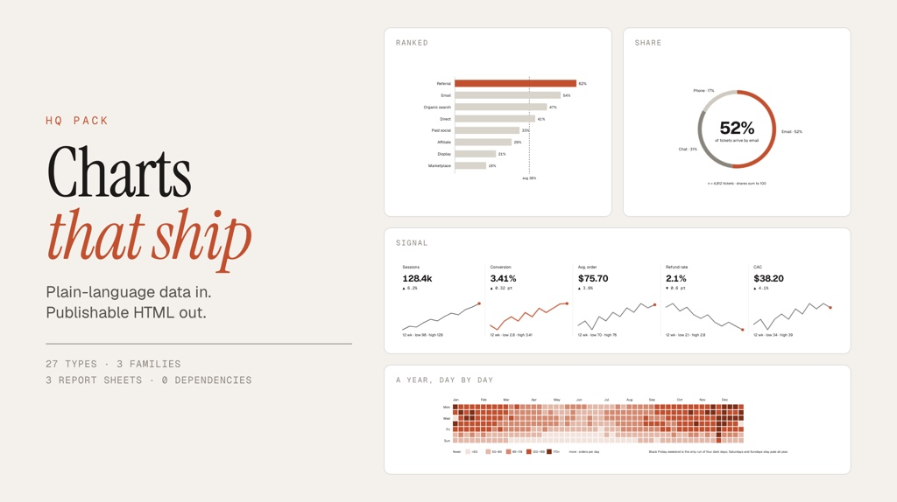

# @indigoai-us/hq-pack-charts



Editorial data charts and report sheets as self-contained HTML. Token-driven,
brand-bound, and linted.

```bash
hq install github:indigoai-us/hq-packages#packages/hq-pack-charts
```

Then:

```
/chart how did returns move month by month after the sizing guide shipped
/chart which of our twelve channels drove the most signups last quarter
/chart a one-pager for the customer survey
```

## What you get

One `.html` file per delivery: embedded stylesheet, inline SVG, CSS-only reveal
motion, no JavaScript needed to draw, no chart library, no external images. Renders
offline, prints, and re-skins by swapping one `:root` block. Light and dark from
the same file.

## The one design decision that matters

**The SVG carries semantic classes. It never carries a colour.**

```svg
<rect class="ch-mark ch-grow" x="160" y="24" width="480" height="24"><title>Email · 480</title></rect>
<path class="ch-line ch-line--hero ch-draw" d="M 40 200 L 120 160 L 200 172"/>
```

Every paint decision lives in `assets/chart.css`. That is the same contract as
`hq-pack-diagrams`, and every `--ch-*` role falls back to its `--dg-*` twin, so a
company brand pack bound for diagrams skins charts with no extra work.

`scripts/lint-chart.py` makes it real: a colour literal, a `style=` attribute, an
external script, `Math.random()`, sub-floor type, two palettes in one file, or a
card without a conclusion title is a hard error. It also warns when bars in a group
are not proportional to the values in their `<title>`.

## Three families, 28 types

Every count here is derived from `knowledge/charts/types/registry.yaml`, and
`scripts/test-lint.py` fails if it drifts. 28 types, 27 with a gallery card, 1 planned.

| Family | Reads in | Built for |
|---|---|---|
| **ledger** (10) | 20–60 s | papers, long reads, annual reviews, audits. One mark per record, real units, marginalia |
| **plain** (10) | 10–30 s | articles, decks, memos. Familiar silhouettes with countable ticks and hairlines |
| **signal** (8) | 3–10 s | weekly reports, dashboards, status. Big numbers, bold bars, deltas |

Plus three report sheets: a survey one-pager, a monthly operations page, and a
fixed-size brief card.

Selection is data-shape first and tiered: ledger and plain primaries are audited
before anything else, fallbacks need a written reason, and signal is a documented
downgrade unless the user asked for a dashboard. Five data shapes bypass the audit
because no honest primary encoding exists. See `knowledge/charts/spec/03-selection.md`.

## Honesty is a linted contract

Bars start at zero and are proportional. Dot size goes through `sqrt`. Ring sweeps
equal share. Every card has a conclusion title, a subtitle with unit and range, and
a source line. Demo data is deterministic and never ships. `spec/02-honesty.md`.

## Palettes

Mono is the floor and always works. Three colour presets are chosen from data
semantics, not asked for: `slate` for ordered series, `moss` for up to four
categories, `ember` for one hero on a quiet field. One palette per file.

## Layout

```
assets/chart.css               the contract
assets/template.html           single-chart starter
assets/galleries/{ledger,plain,signal}.html   one card per type
assets/sheets/{one-pager,monthly,brief-card}.html
assets/examples/               finished deliveries
knowledge/charts/spec/         nine spec files
knowledge/charts/types/        registry.yaml + selection table
scripts/lint-chart.py · sync-assets.py · contact-sheet.py · test-lint.py
skills/chart/SKILL.md
```

## Verify

```bash
python3 scripts/test-lint.py
python3 scripts/lint-chart.py --all
python3 scripts/contact-sheet.py assets/galleries/*.html --cols 3 --open
```

## Provenance

The family split, data-shape-first selection, tiered audit with written
rejections, one-conclusion cards, and one-palette-per-delivery were studied in the
open-source `lieflat-charts` skill, which is licensed PolyForm Noncommercial.
Nothing from it is copied: every template, token, rule, and script here is HQ's
own and ships under MIT.
